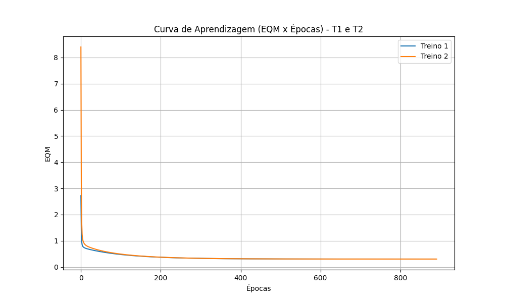

# Atividade 2 - Adaline

## 1. Treinamentos

| Treinamento | Wi (w0, w1, w2, w3, w4) | Wf (w0, w1, w2, w3, w4) | Épocas |
|-------------|---------------------------|---------------------------|--------|
| 1o (T1) | 0.3745, 0.9507, 0.7320, 0.5987, 0.1560 | -1.8130, 1.3129, 1.6423, -0.4275, -1.1778 | 888 |
| 2o (T2) | 0.1560, 0.0581, 0.8662, 0.6011, 0.7081 | -1.8130, 1.3129, 1.6423, -0.4276, -1.1778 | 891 |
| 3o (T3) | 0.0206, 0.9699, 0.8324, 0.2123, 0.1818 | -1.8130, 1.3129, 1.6423, -0.4277, -1.1778 | 848 |
| 4o (T4) | 0.1834, 0.3042, 0.5248, 0.4319, 0.2912 | -1.8130, 1.3129, 1.6423, -0.4277, -1.1777 | 885 |
| 5o (T5) | 0.6119, 0.1395, 0.2921, 0.3664, 0.4561 | -1.8131, 1.3129, 1.6423, -0.4277, -1.1778 | 916 |

## 2. Gráfico do EQM x Épocas

## 3. Classificação das Amostras (Teste)

| Amostra | x1 | x2 | x3 | x4 | y (T1) | y (T2) | y (T3) | y (T4) | y (T5) |
|---------|----|----|----|----|--------|--------|--------|--------|--------|
| 1 | 0.9694 | 0.6909 | 0.4334 | 3.4965 | -1 | -1 | -1 | -1 | -1 |
| 2 | 0.5427 | 1.3832 | 0.6390 | 4.0352 | -1 | -1 | -1 | -1 | -1 |
| 3 | 0.6081 | -0.9196 | 0.5925 | 0.1016 | 1 | 1 | 1 | 1 | 1 |
| 4 | -0.1618 | 0.4694 | 0.2030 | 3.0117 | -1 | -1 | -1 | -1 | -1 |
| 5 | 0.1870 | -0.2578 | 0.6124 | 1.7749 | -1 | -1 | -1 | -1 | -1 |
| 6 | 0.4891 | -0.5276 | 0.4378 | 0.6439 | 1 | 1 | 1 | 1 | 1 |
| 7 | 0.3777 | 2.0149 | 0.7423 | 3.3932 | 1 | 1 | 1 | 1 | 1 |
| 8 | 1.1498 | -0.4067 | 0.2469 | 1.5866 | 1 | 1 | 1 | 1 | 1 |
| 9 | 0.9325 | 1.0950 | 1.0359 | 3.3591 | 1 | 1 | 1 | 1 | 1 |
| 10 | 0.5060 | 1.3317 | 0.9222 | 3.7174 | -1 | -1 | -1 | -1 | -1 |
| 11 | 0.0497 | -2.0656 | 0.6124 | -0.6585 | -1 | -1 | -1 | -1 | -1 |
| 12 | 0.4004 | 3.5369 | 0.9766 | 5.3532 | 1 | 1 | 1 | 1 | 1 |
| 13 | -0.1874 | 1.3343 | 0.5374 | 3.2189 | -1 | -1 | -1 | -1 | -1 |
| 14 | 0.5060 | 1.3317 | 0.9222 | 3.7174 | -1 | -1 | -1 | -1 | -1 |
| 15 | 1.6375 | -0.7911 | 0.7537 | 0.5515 | 1 | 1 | 1 | 1 | 1 |

