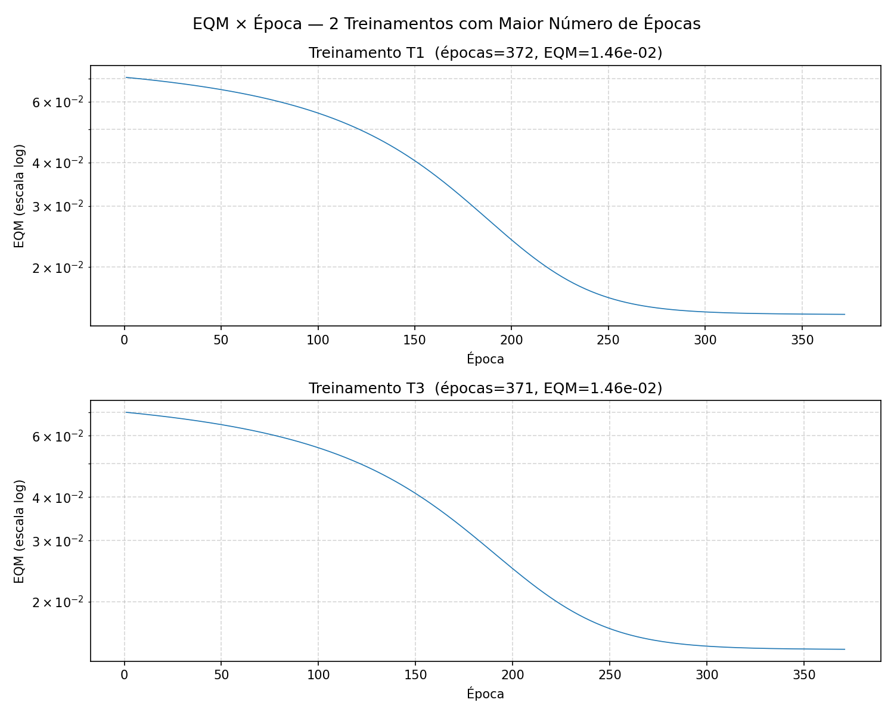

# PMC1 — Rede Perceptron para Regressão: Sistema de Ressonância Magnética

## Descrição do Problema

Estimar a variável `y` (energia absorvida) a partir de três grandezas medidas `{x1, x2, x3}`, já normalizadas, utilizando uma rede Perceptron Multicamadas treinada pelo algoritmo de Backpropagation (Regra Delta Generalizada).

## Topologia da Rede

| Camada     | Neurônios |
|------------|-----------|
| Entrada    | 3         |
| Oculta     | 5         |
| Saída      | 1         |

- **Função de ativação:** Logística (sigmoid) em todos os neurônios  
- **Taxa de aprendizado:** η = 0,1  
- **Precisão (critério de parada):** ε = 10⁻⁶  
- **Critério:** `|EQM(t) - EQM(t-1)| < ε`  
- **Aprendizado:** Lote (*batch*)

---

## Item 2 — Tabela dos 5 Treinamentos

| Treinamento | EQM Final  | Nº de Épocas |
|-------------|-----------|--------------|
| T1          | 0,01460973 | 372          |
| T2          | 0,01544370 | 272          |
| T3          | 0,01459898 | 371          |
| T4          | 0,01594712 | 259          |
| T5          | 0,01604954 | 269          |

---

## Item 3 — Gráficos EQM × Época

Os dois treinamentos com **maior número de épocas** foram **T1** (372 épocas) e **T3** (371 épocas).

> Gráfico gerado: `graficos_eqm.png`



Os dois gráficos mostram comportamento semelhante: queda abrupta nas primeiras dezenas de épocas, seguida de convergência gradual até o critério de parada.

---

## Item 4 — Explicação da Variação Entre Treinamentos

### Por que o EQM e o número de épocas variam de treinamento para treinamento?

A causa principal é a **inicialização aleatória dos pesos**. Em cada treinamento, os pesos iniciais são sorteados de forma diferente (sementes distintas), o que influencia diretamente o comportamento do treinamento pelos seguintes motivos:

1. **Superfície de erro não convexa:** A função de custo (EQM) de uma rede MLP é multimodal e possui múltiplos mínimos locais. Dependendo do ponto de partida (pesos iniciais), o algoritmo de gradiente descendente pode convergir para mínimos locais diferentes, com valores de EQM distintos.

2. **Gradiente local diferente:** Pesos iniciais diferentes resultam em gradientes diferentes na primeira época. Alguns pontos de partida estão em regiões com gradientes mais íngremes (convergência mais rápida, menos épocas) e outros em platôs ou regiões de gradiente suave (convergência mais lenta, mais épocas).

3. **Saturação da função sigmoid:** Se os pesos iniciais são grandes, os neurônios entram em saturação desde o início (saída próxima de 0 ou 1), produzindo gradientes muito pequenos — o chamado problema do **gradiente desaparecente** — o que aumenta o número de épocas necessárias.

4. **Trajetórias de otimização distintas:** Mesmo que dois treinamentos convirjam para mínimos locais com EQMs próximos (como T1 = 0,0146 e T3 = 0,0146), as trajetórias percorridas no espaço de pesos são diferentes, resultando em números de épocas ligeiramente diferentes.

Em resumo: pesos iniciais determinam a trajetória de otimização. Pequenas diferenças iniciais podem levar a convergências diferentes em velocidade e qualidade.

---

## Item 5 — Validação: Erro Relativo Médio e Variância

| Treinamento | ERM (%)   | Variância (%²) |
|-------------|----------|----------------|
| T1          | 24,3267  | 883,70         |
| T2          | 25,3972  | 952,41         |
| T3          | 24,6277  | 889,94         |
| T4          | 25,7138  | 988,70         |
| T5          | 25,6386  | 984,47         |

**Fórmula utilizada:**

```
ERM = (1/N) × Σ |d_i - y_i| / d_i × 100 %
Variância = Var{ |d_i - y_i| / d_i × 100 }
```

---

## Item 6 — Melhor Configuração para o Sistema de Ressonância Magnética

**Recomendação: T1**

Justificativa:

- T1 apresentou o **menor ERM (24,33%)** no conjunto de teste.
- T1 também apresentou a **menor variância (883,70 %²)**, indicando maior consistência nas estimativas ao longo das 20 amostras.
- Embora T3 tenha EQM de treinamento ligeiramente menor (0,01460 vs 0,01461), T1 generaliza melhor para dados não vistos, que é o objetivo final de um sistema de ressonância magnética em operação.
- Menor variância é especialmente importante em aplicações médicas, pois indica que a rede não comete erros muito discrepantes em nenhuma amostra específica.

> A configuração T1 oferece o melhor equilíbrio entre erro médio e consistência de generalização.

---

## Arquivos Gerados

| Arquivo          | Descrição                               |
|------------------|-----------------------------------------|
| `pmc1.py`        | Implementação completa (Python/NumPy)   |
| `graficos_eqm.png` | Gráficos EQM × Época de T1 e T3      |
