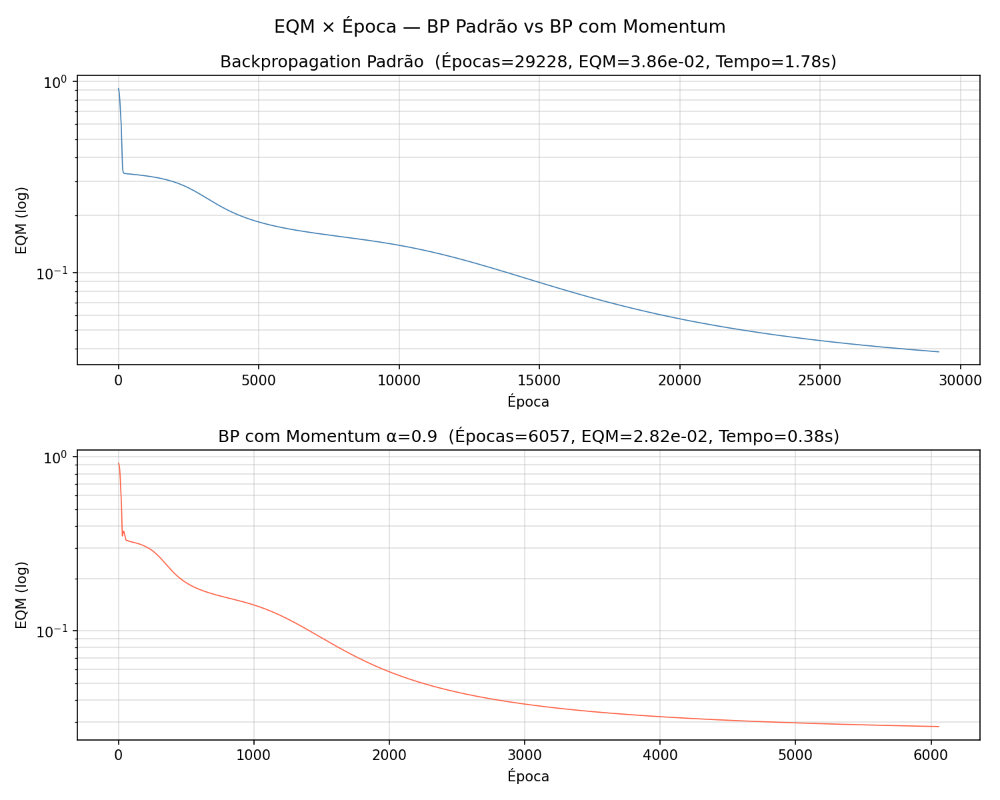

# PMC2 — Rede Perceptron para Classificação: Conservantes de Bebidas

## Descrição do Problema

Classificar, em função de quatro variáveis medidas `{x1, x2, x3, x4}` (teor de água, grau de acidez, temperatura e tensão superficial), o tipo de conservante (A, B ou C) a ser aplicado em um lote de bebida.

## Codificação das Saídas

| Conservante | y1 | y2 | y3 |
|-------------|----|----|-----|
| Tipo A      | 1  | 0  | 0   |
| Tipo B      | 0  | 1  | 0   |
| Tipo C      | 0  | 0  | 1   |

## Topologia da Rede

| Camada  | Neurônios |
|---------|-----------|
| Entrada | 4         |
| Oculta  | 7         |
| Saída   | 3         |

- **Função de ativação:** Logística (sigmoid) em todos os neurônios  
- **Taxa de aprendizado:** η = 0,1  
- **Fator de momentum:** α = 0,9 (apenas no segundo treinamento)  
- **Precisão:** ε = 10⁻⁶  
- **Critério:** `|EQM(t) - EQM(t-1)| < ε`  
- **Pesos iniciais:** **idênticos** nos dois treinamentos (semente 7)

---

## Item 1 — BP Padrão

Treinamento com backpropagation sem momentum.

| Parâmetro      | Valor        |
|----------------|--------------|
| EQM Final      | 0,03860664   |
| Nº de Épocas   | 29.228        |
| Tempo          | 1,78 s       |

---

## Item 2 — BP com Momentum (α = 0,9)

Treinamento com os **mesmos pesos iniciais** do item anterior.

| Parâmetro      | Valor       |
|----------------|-------------|
| EQM Final      | 0,02815236  |
| Nº de Épocas   | 6.057        |
| Tempo          | 0,38 s      |

### Comparativo

| Critério          | BP Padrão | BP + Momentum |
|-------------------|-----------|---------------|
| EQM Final         | 0,0386    | 0,0282        |
| Épocas            | 29.228     | 6.057          |
| Tempo             | 1,78 s    | 0,38 s        |
| Redução de épocas | —         | **≈ 4,8×**    |

O Momentum acelerou a convergência em aproximadamente **5 vezes** e ainda encontrou um mínimo com EQM menor.

---

## Item 3 — Gráficos EQM × Época

> Gráfico gerado: `graficos_eqm.png`



O gráfico superior (BP Padrão) mostra descida mais lenta e com mais oscilações. O inferior (BP + Momentum) mostra convergência significativamente mais rápida com boa estabilidade.

---

## Item 4 — Pós-processamento das Saídas

O critério de **arredondamento simétrico** converte cada saída real `y_i ∈ (0,1)` para inteiro:

```
y_i_bin = 1  se y_i ≥ 0,5
y_i_bin = 0  se y_i < 0,5
```

A classe predita é o vetor `[y1_bin, y2_bin, y3_bin]` comparado com os alvos `[d1, d2, d3]`.

---

## Item 5 — Validação no Conjunto de Teste (18 amostras)

| Algoritmo       | Taxa de Acerto |
|-----------------|---------------|
| BP Padrão       | **100,00 %**  |
| BP com Momentum | **100,00 %**  |

Ambos os algoritmos classificaram corretamente **todas as 18 amostras** de teste, demonstrando excelente generalização.

### Tabela de Predições (BP Padrão)

| Amostra | Classe Real | Predição | Acerto? |
|---------|-------------|----------|---------|
| 1       | C (0,0,1)   | C        | ✓       |
| 2       | A (1,0,0)   | A        | ✓       |
| 3       | C (0,0,1)   | C        | ✓       |
| 4       | B (0,1,0)   | B        | ✓       |
| 5       | C (0,0,1)   | C        | ✓       |
| 6       | A (1,0,0)   | A        | ✓       |
| 7       | B (0,1,0)   | B        | ✓       |
| 8       | B (0,1,0)   | B        | ✓       |
| 9       | A (1,0,0)   | A        | ✓       |
| 10      | A (1,0,0)   | A        | ✓       |
| 11      | B (0,1,0)   | B        | ✓       |
| 12      | A (1,0,0)   | A        | ✓       |
| 13      | C (0,0,1)   | C        | ✓       |
| 14      | C (0,0,1)   | C        | ✓       |
| 15      | C (0,0,1)   | C        | ✓       |
| 16      | A (1,0,0)   | A        | ✓       |
| 17      | C (0,0,1)   | C        | ✓       |
| 18      | B (0,1,0)   | B        | ✓       |

---

## Conclusão

- O **BP com Momentum** é superior ao BP padrão neste problema: convergiu ~5× mais rápido, atingiu menor EQM e ambos generalizaram perfeitamente (100% de acerto).
- O momentum funciona acumulando direção de descida ao longo das épocas, o que evita oscilações em vales estreitos e acelera a travessia de platôs, explicando a diferença de 29.228 para 6.057 épocas.
- Para aplicação industrial (classificação automática de conservantes na linha de produção), **recomenda-se o BP com Momentum** por sua eficiência computacional e qualidade de solução.

---

## Arquivos Gerados

| Arquivo            | Descrição                             |
|--------------------|---------------------------------------|
| `pmc2.py`          | Implementação completa (Python/NumPy) |
| `graficos_eqm.png` | Gráficos EQM × Época (ambos os algoritmos) |
