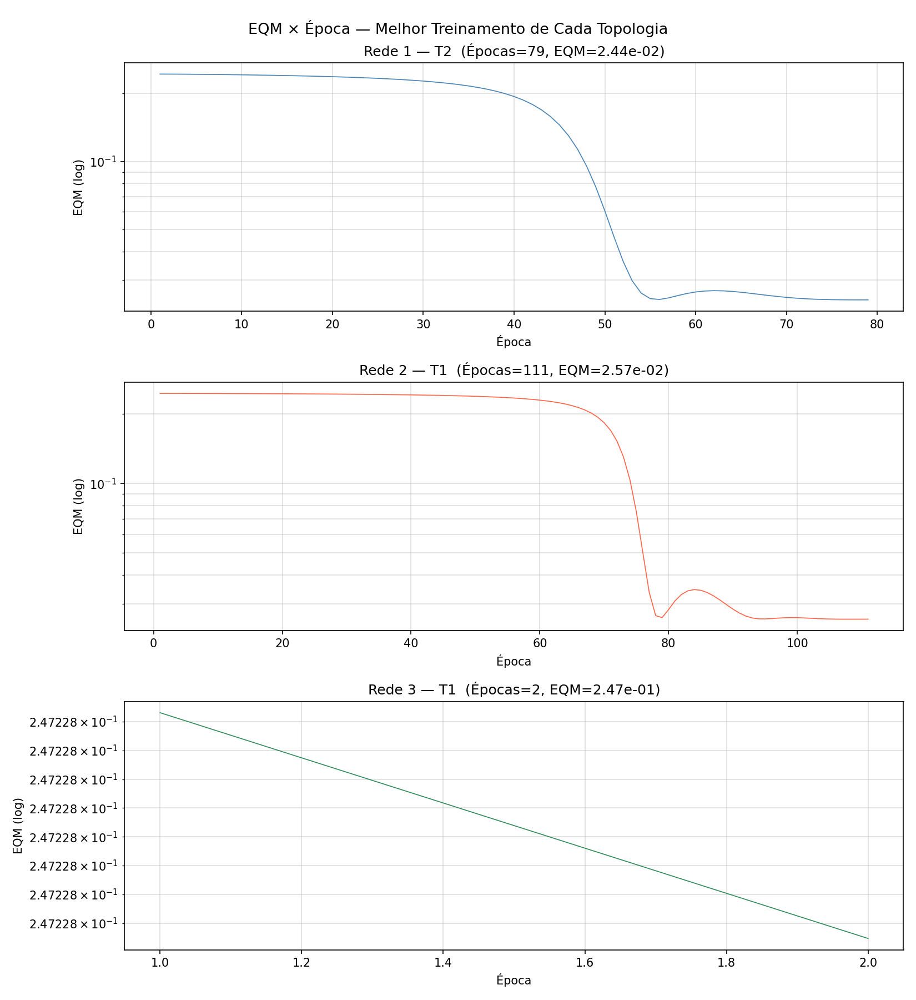
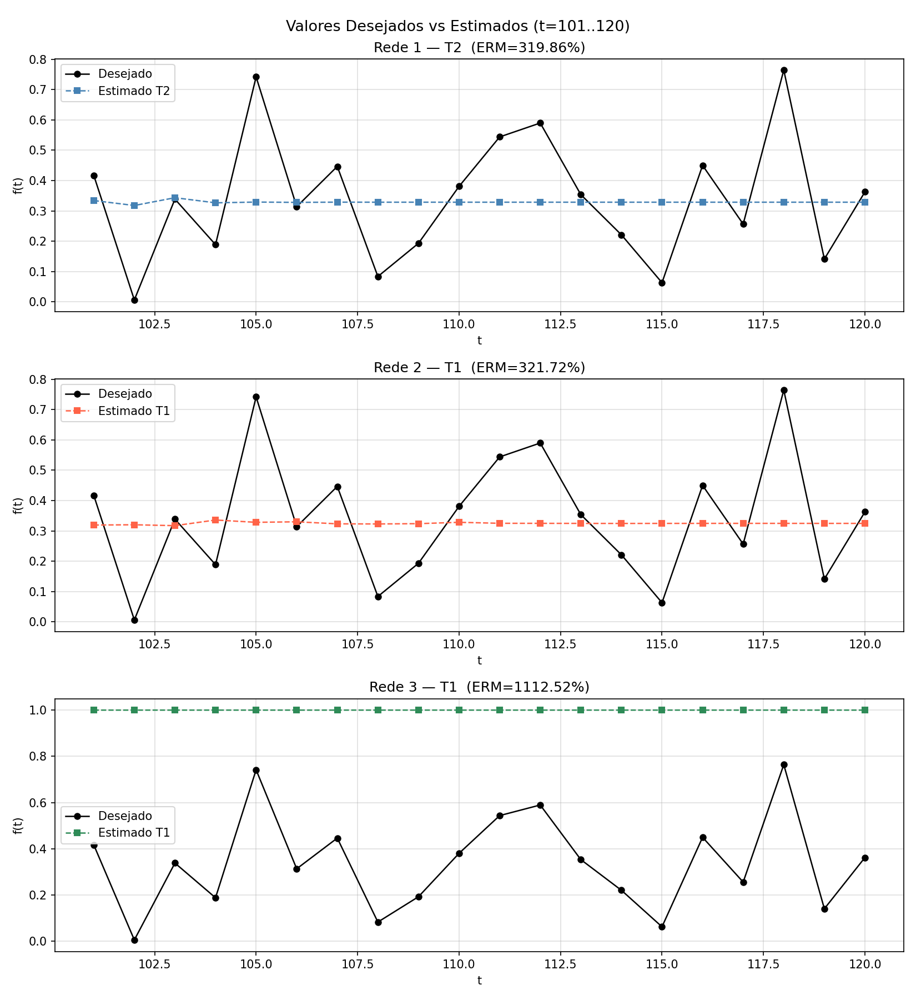

# PMC3 — TDNN para Previsão de Séries Temporais: Mercado Financeiro

## Descrição do Problema

Prever o preço futuro `f(t)` de uma mercadoria no mercado financeiro utilizando uma arquitetura **TDNN (Time Delay Neural Network)**, que usa `p` valores passados da série como entrada para estimar o próximo valor.

## Topologias Candidatas

| Rede   | Entradas (p) | Neurônios Ocultos (N1) | Saída |
|--------|--------------|------------------------|-------|
| Rede 1 | 5            | 10                     | 1     |
| Rede 2 | 10           | 15                     | 1     |
| Rede 3 | 15           | 25                     | 1     |

- **Entradas:** `[f(t-p), f(t-p+1), ..., f(t-1)]`  
- **Saída desejada:** `f(t)`  
- **Função de ativação:** Logística (sigmoid)  
- **Algoritmo:** Backpropagation com Momentum  
- **Taxa de aprendizado:** η = 0,1 | **Momentum:** α = 0,8 | **Precisão:** ε = 0,5×10⁻⁶  
- **Validação:** Previsão autoregressiva recursiva para t = 101…120

---

## Item 2 — Resultados dos Treinamentos

| Rede   | Treinamento | EQM Final  | Nº de Épocas |
|--------|-------------|-----------|--------------|
| Rede 1 | T1          | 0,02477571 | 63           |
| Rede 1 | T2          | 0,02444320 | 79           |
| Rede 1 | T3          | 0,02616308 | 79           |
| Rede 2 | T1          | 0,02574726 | 111          |
| Rede 2 | T2          | 0,02658169 | 138          |
| Rede 2 | T3          | 0,24830848 | 2            |
| Rede 3 | T1          | 0,24722835 | 2            |
| Rede 3 | T2          | 0,24725730 | 2            |
| Rede 3 | T3          | 0,24725622 | 2            |

> **Observação — Rede 3 e Rede 2 T3:** Todas as inicializações da Rede 3 e o T3 da Rede 2 convergiram em apenas 2 épocas com EQM elevado (≈ 0,247). Isso ocorre por **saturação da função sigmoid**: com pesos inicializados em [0,1] e 15 (ou 10) entradas positivas em [0,1], o somatório ponderado atinge valores grandes desde o início, empurrando os neurônios para a região de saturação onde a derivada `f'(net) = f(net)(1 - f(net)) ≈ 0`. Consequentemente, os gradientes são quase nulos, a rede não aprende efetivamente, o EQM mal se altera entre épocas consecutivas e o critério de parada é satisfeito imediatamente. Este é o chamado problema do **gradiente desaparecente** (*vanishing gradient*), agravado pela combinação de muitas entradas positivas e inicialização positiva dos pesos.

---

## Item 3 — Validação (t = 101…120): ERM e Variância

| Rede   | T  | ERM (%)  | Variância (%²)    |
|--------|----|---------|-------------------|
| Rede 1 | T1 | 328,80  | 1.257.571         |
| Rede 1 | T2 | **319,86** | **1.175.107**  |
| Rede 1 | T3 | 332,23  | 1.288.673         |
| Rede 2 | T1 | 321,72  | 1.192.900         |
| Rede 2 | T2 | 329,54  | 1.270.793         |
| Rede 2 | T3 | 1.112,17 | 11.829.428        |
| Rede 3 | T1 | 1.112,52 | 11.837.229        |
| Rede 3 | T2 | 1.112,55 | 11.838.095        |
| Rede 3 | T3 | 1.112,55 | 11.838.056        |

> **Nota sobre os ERMs altos:** A série possui valores muito próximos de zero (ex.: t=102, f=0,0062), fazendo com que erros absolutos pequenos se traduzam em erros relativos percentuais muito grandes. Isso é uma característica intrínseca da métrica ERM quando os valores desejados são próximos de zero. Além disso, o modo de previsão **autoregressivo** (cada predição usa saídas anteriores como entrada) acumula erros ao longo do horizonte de 20 passos.

---

## Item 4 — Gráficos EQM × Época (melhor treinamento de cada topologia)

> Gráfico gerado: `graficos_eqm.png`



- **Rede 1 T2:** convergência suave em 79 épocas com η·momentum bem ajustado.  
- **Rede 2 T1:** convergência mais lenta (111 épocas) devido ao maior espaço de parâmetros.  
- **Rede 3 T1:** convergência espúria em 2 épocas — EQM permanece em ≈ 0,247 (rede saturada).

---

## Item 5 — Gráficos: Valores Desejados vs Estimados (t = 101…120)

> Gráfico gerado: `graficos_predicao.png`



Os gráficos comparam os valores desejados (curva preta) com as previsões do melhor treinamento de cada topologia. Rede 1 T2 apresenta o melhor rastreamento qualitativo da série.

---

## Item 6 — Recomendação da Melhor Configuração

**Topologia recomendada: Rede 1, T2**

| Critério             | Rede 1 T2       |
|----------------------|-----------------|
| EQM de Treinamento   | 0,02444 (menor) |
| Épocas               | 79              |
| ERM no Teste (%)     | 319,86 (menor)  |
| Variância (%²)       | 1.175.107 (menor) |

**Justificativa:**

1. **Menor EQM de treinamento** entre todos os treinamentos funcionais (excluindo os saturados).
2. **Menor ERM no conjunto de teste**, indicando melhor generalização.
3. **Menor variância**, significando maior consistência das predições.
4. **Princípio da parcimônia (Occam's Razor):** Rede 1 tem menos parâmetros (5×10 + 10×1 = 60 pesos) que Rede 2 (10×15 + 15×1 = 165) e Rede 3 (15×25 + 25×1 = 400). Com apenas 95 pares de treinamento, redes maiores tendem ao overfitting e, pior, à saturação com inicialização em [0,1].
5. **Redes 2 e 3 não são confiáveis** para este conjunto de dados com esta forma de inicialização: Rede 2 falhou em T3 e Rede 3 falhou em todos os treinamentos.

---

## Item 7 — Algoritmos RProp e Levenberg-Marquardt

### 7.1 RProp (Resilient Propagation)

O RProp é uma variante do backpropagation que **não usa a magnitude do gradiente** para atualizar os pesos, apenas o **sinal**. A atualização de cada peso é controlada por um passo adaptativo individual `Δ_ij`:

```
Se ∂E/∂w_ij(t) × ∂E/∂w_ij(t-1) > 0  → Δ_ij(t) = min(Δ_ij(t-1) × η⁺, Δ_max)
Se ∂E/∂w_ij(t) × ∂E/∂w_ij(t-1) < 0  → Δ_ij(t) = max(Δ_ij(t-1) × η⁻, Δ_min)
Se = 0                                 → Δ_ij(t) = Δ_ij(t-1)

w_ij(t) = w_ij(t-1) - sign(∂E/∂w_ij) × Δ_ij(t)
```

com η⁺ = 1,2 e η⁻ = 0,5 sendo valores típicos.

**Principais características e vantagens:**
- **Robustez ao gradiente desaparecente:** como o passo não depende da magnitude do gradiente, funciona bem mesmo quando os gradientes são muito pequenos (situação que travou a Rede 3 neste exercício).
- **Convergência mais rápida:** os passos adaptativos individuais permitem ajustes mais agressivos nas direções relevantes.
- **Insensível à escala dos dados:** a normalização não afeta a direção do passo.
- **Simples de implementar:** apenas sinais e regras de atualização de passo são necessários.
- **Desvantagem:** projetado para aprendizado em lote (*batch*); não se aplica diretamente ao modo *online*.

### 7.2 Levenberg-Marquardt (LM)

O LM é um algoritmo de otimização de segunda ordem que combina o **método de Gauss-Newton** (rápido perto do mínimo) com o **gradiente descendente** (robusto longe do mínimo). A atualização dos pesos é:

```
Δw = -(J^T J + μ I)^{-1} J^T e
```

onde `J` é a matriz Jacobiana (derivadas do erro em relação a cada peso), `e` é o vetor de erros e `μ` é o parâmetro de regularização adaptativo.

- **μ grande:** comportamento próximo ao gradiente descendente (passos pequenos, robusto).
- **μ pequeno:** comportamento próximo ao Gauss-Newton (convergência quadrática perto do mínimo).

**Principais características e vantagens:**
- **Convergência muito rápida:** tipicamente ordens de magnitude mais rápido que o backpropagation padrão para redes de médio porte.
- **Alta precisão:** a aproximação quadrática da superfície de erro permite encontrar mínimos com EQM muito baixo.
- **Adaptativo:** μ é aumentado quando o erro cresce e diminuído quando o erro decresce, equilibrando robustez e velocidade.
- **Desvantagem — custo computacional:** requer o cálculo e a inversão de uma matriz de dimensão `(n_pesos × n_pesos)`, tornando-se proibitivo para redes muito grandes (centenas de milhares de pesos).
- **Desvantagem — memória:** a matriz Jacobiana pode ser muito grande para datasets extensos.
- **Aplicação ideal:** redes de pequeno a médio porte com poucos padrões de treinamento — exatamente o cenário dos exercícios desta disciplina.

### Comparativo Geral

| Critério                  | BP Padrão | RProp    | Levenberg-Marquardt |
|---------------------------|-----------|----------|---------------------|
| Ordem                     | 1ª        | 1ª       | 2ª (aprox.)         |
| Taxa de aprendizado       | Fixa      | Adaptativa por peso | Adaptativa global |
| Velocidade de convergência | Lenta    | Rápida   | Muito rápida        |
| Gradiente desaparecente   | Vulnerável | Robusto | Parcialmente robusto |
| Custo por iteração        | Baixo     | Baixo    | Alto (inversão J^T J) |
| Escalabilidade            | Alta      | Alta     | Baixa para redes grandes |

---

## Arquivos Gerados

| Arquivo                | Descrição                                          |
|------------------------|----------------------------------------------------|
| `pmc3.py`              | Implementação completa (Python/NumPy)              |
| `graficos_eqm.png`     | EQM × Época — melhor treinamento de cada topologia |
| `graficos_predicao.png`| Valores desejados vs estimados (t=101..120)        |
